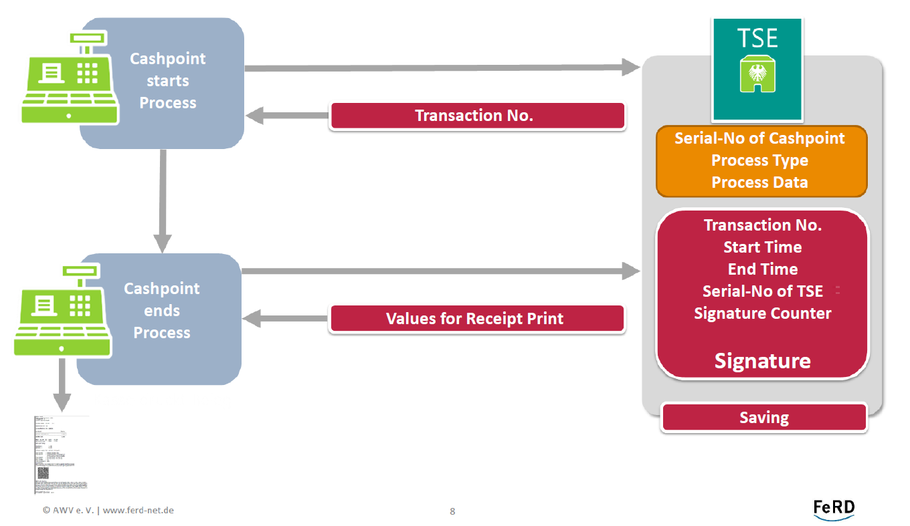

# German's legislation on eReceipts

## German's tax administration view on the data set

In Germany, an e-Receipt is required for every business transaction. There is a [new German law to protect against manipulation of basic digital records](https://www.bundesfinanzministerium.de/Content/DE/Gesetzestexte/Gesetze_Gesetzesvorhaben/Abteilungen/Abteilung_IV/18_Legislaturperiode/Gesetze_Verordnungen/2016-12-28-Kassenmanipulationsschutzgestz/0-Gesetz.html) that requires every electronic Cashpoint or Point-of-Service (POS) system to track not only business transaction (see [AEAO-E § 146a Tz. 1.6](https://www.bundesfinanzministerium.de/Content/DE/Downloads/BMF_Schreiben/Weitere_Steuerthemen/Abgabenordnung/AO-Anwendungserlass/2019-06-17-einfuehrung-paragraf-146a-AO-anwendungserlass-zu-paragraf-146a-AO.html)) but also other incidents (training receipts, cancellations, etc., see [AEAO-E § 146a Tz. 1.7](https://www.bundesfinanzministerium.de/Content/DE/Downloads/BMF_Schreiben/Weitere_Steuerthemen/Abgabenordnung/AO-Anwendungserlass/2019-06-17-einfuehrung-paragraf-146a-AO-anwendungserlass-zu-paragraf-146a-AO.pdf?__blob=publicationFile&v=4)) by a [standardized secure module (TSE)](https://www.bsi.bund.de/SharedDocs/Downloads/DE/BSI/Publikationen/TechnischeRichtlinien/TR03153/TR-03153.pdf?__blob=publicationFile&v=7).

The German e-Receipt Taxonomy [here an early version](https://dfka.net/wp-content/uploads/2018/08/Dokumentation_DFKA-Taxonomie-Kassendaten_V1-Pilot-1.pdf) was created by the [German professional association for cash registers and accounting system technology](https://dfka.net/der-dfka/) and is being used by the [German Federal Tax Authority](https://www.bzst.de/DE/Unternehmen/Aussenpruefungen/DigitaleSchnittstelleFinV/digitaleschnittstellefinv_node.html#js-toc-entry3).

## List of possible Business Transactions (Cashpoint)

1. **Revenue** / *Umsatz*
1. **Refund** / *Pfand*
1. **Refund Refund** / *Pfand Rueckzahlung*
1. **Discount** / *Rabatt*
1. **Surcharge** / *Aufschlag*
1. **Grant real** / *Zuschuss echt*
1. **Grant fake** / *Zuchuss unecht*
1. **Tip Employer** / *Trinkgeld Arbeitgeber*
1. **Tip employees** / *Trinkgeld Arbeitnehmer*
1. **Single purpose voucher purchase** / *Einzweckgutschein Kauf*
1. **Single purpose voucher redemption** / *Einzweckgutschein Einloesung*
1. **Multi-purpose voucher purchase** / *Mehrzweckgutschein Kauf*
1. **Multi-purpose voucher redemption** / *Mehrzweckgutschein Einloesung*
1. **Creation of receivables** / *Forderungsentstehung*
1. **Dissolution of receivables** / *Forderungsaufloesung*
1. **Down payment setting** / *Anzahlungseinstellung*
1. **Dissolution of deposit** / *Anzahlungsaufloesung*
1. **Opening balance** / *Anfangsbestand*
1. **Private withdrawal** / *Privatentnahme*
1. **Private deposit** / *Privateinlage*
1. **Change Deposit** / *Wechselgeld Einlage*
1. **Money Transit** / *Geldtransit*
1. **Wage payment** / *Lohnzahlung*
1. **Deposit** / *Einzahlung*
1. **Withdrawal** / *Auszahlung*
1. **Difference Debits Credits** / *Differenz Soll Ist*

All explained in chapter 3.4 Business Transactions of the German e-Receipt Taxonomy [see early version in German.](https://dfka.net/wp-content/uploads/2018/08/Dokumentation_DFKA-Taxonomie-Kassendaten_V1-Pilot-1.pdf)
